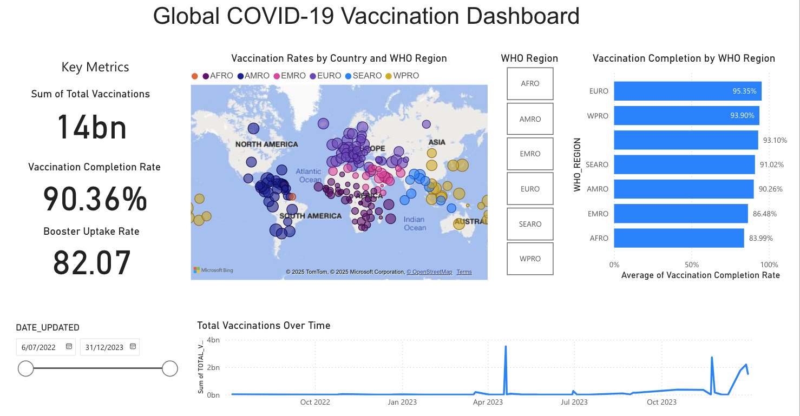

# WHO COVID-19 Vaccination Dashboard

This project features an **interactive Power BI dashboard** that visualizes **global COVID-19 vaccination data**. The dashboard demonstrates skills in data preprocessing, visualization, and interactive reporting.

## Project Overview

- **Tool Used**: Power BI (Free Tier)
- **Dataset Source**: [World Health Organization (WHO) COVID-19 Data](https://data.who.int/dashboards/covid19/data?n=o)
- **Skills Highlighted**:
  - Data Cleaning & Preprocessing
  - Data Visualization & Storytelling
  - Interactive Dashboards using Slicers & Tooltips
  - Regional and Time-Series Analysis

## Key Features of the Dashboard

1. **Global Map Visualization**:
   - Displays **vaccination rates per 100 people** across countries.
   - Color-coded by **WHO Region** for better regional insights.

2. **Bar Chart**:
   - Shows **Vaccination Completion Rates** by WHO Region.
   - Highlights disparities and trends in vaccination completion globally.

3. **Line Chart**:
   - Illustrates **Total Vaccinations Over Time**, showing global trends and vaccination spikes.

4. **Slicers for Interactivity**:
   - Filter data by **WHO Region** and **Date Range**.
   - Dynamic updates to visuals based on user selection.

5. **Tooltips for Enhanced Insights**:
   - Hover over visuals to see detailed statistics like **Booster Uptake Rate** and **Vaccination Completion Rate**.

## How to Use the Dashboard

1. **Open the `.pbix` file** in **Power BI Desktop** (free to download).
2. Explore interactive features like **slicers** and **hover tooltips**.
3. Analyze global vaccination trends and regional disparities.

## Dataset Description

- **vaccination-data.csv** contains:
  - `COUNTRY`: Name of the country.
  - `WHO_REGION`: WHO classification of regions.
  - `TOTAL_VACCINATIONS`: Total doses administered.
  - `PERSONS_VACCINATED_1PLUS_DOSE`: Individuals with at least one dose.
  - `PERSONS_LAST_DOSE`: Individuals fully vaccinated.
  - `PERSONS_BOOSTER_ADD_DOSE`: Individuals who received a booster dose.
  - `DATE_UPDATED`: Last update date for vaccination data.

## Transferable Skills Demonstrated

While this dashboard focuses on **COVID-19 vaccination data**, the skills demonstrated are highly **transferable** to roles analyzing data in other sectors, such as **legal, healthcare, and public reporting**:

- **Demographic Analysis**: Understanding how different regions behave with respect to vaccinations parallels demographic behavior analysis in fields like public health and legal systems.
- **Time-Series Trend Analysis**: Identifying trends over time is valuable for understanding patterns in legal cases, healthcare metrics, and more.
- **Interactive Reporting**: Creating interactive dashboards to filter and drill down into specific data subsets mirrors how stakeholders need dynamic data exploration in real-world scenarios.

## Screenshots

## Future Enhancements

- Adding **predictive analytics** to forecast future vaccination rates.
- Integrating **Python scripts** within Power BI for advanced analytics.
- Expanding to include **comparative dashboards** for other public health datasets.

---

Feel free to explore the dashboard and reach out with feedback or suggestions! 🚀

Thank you for visiting my repository!
